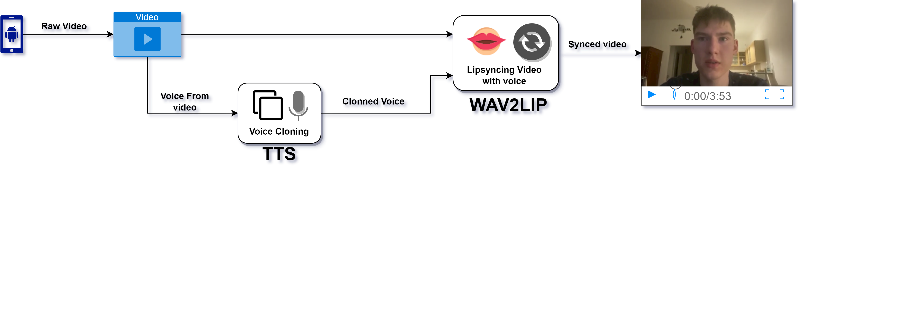

# Digital Twin

## Authors:
Imre Molnár

Zsolt Csibi

## Supervisor: 
Dos Santos Melício Bruno Carlos

# Goal
Create a digital twin, which should work like:
1. We have take an input video of a person
2. We split the video and audio
3. Train a model on the video and audio
4. We prompt a text
5. Then the model generates a video of a person saying that text with the person’s voice

# Technologies we tried
## Video generation:

- 3DDFA [https://github.com/cleardusk/3DDFA](https://github.com/cleardusk/3DDFA)
- Thin Plate Spline Motion Model [https://github.com/yoyo-nb/Thin-Plate-Spline-Motion-Model](https://github.com/yoyo-nb/Thin-Plate-Spline-Motion-Model)
- First Order Model [https://github.com/AliaksandrSiarohin/first-order-model](https://github.com/AliaksandrSiarohin/first-order-model)
- Wav2Lip [https://github.com/Rudrabha/Wav2Lip](https://github.com/Rudrabha/Wav2Lip)

## Audio generation:
- Real Time Voice Cloning [https://github.com/CorentinJ/Real-Time-Voice-Cloning](https://github.com/CorentinJ/Real-Time-Voice-Cloning)
- TTS [https://github.com/mozilla/TTS](https://github.com/mozilla/TTS)

# 3DDFA
- The idea was to create a 3D model from a video, so an avatar can be created
- It gives a relatively good 3D model, but Wav2lip do not need a 3D model for lip syncing, it is not necessary for our goals

# Thin Plate Spline Motion Model
- It makes a video based on an image and a reference video
- It was also very slow

# First Order Model
- We still have nightmares after this
- Results are bad, also a relatively slow method

# Real Time Voice Cloning

[sample](./docs/7dia.wav)

- It did not handle noisy recordings.
- It was very slow.
- Needs a lots of training data.
- The generated audio sounds like a robot.

# TTS

[sample](./docs/8dia.wav)

- TTS provided pretty good results regarding audio.
- The generated audio sound pretty close to the sample.
- The audio generation is also fast.
- It was also easy to setup.
- For the reference videos we used the pretrained multilingual models.

# TTS + Wav2Lip

- It gave us a pretty good result
- It’s highly depend on where the face is on the recording
- Better results with 720p and 480p landscape videos
- Higher resolution videos gave artifacts

